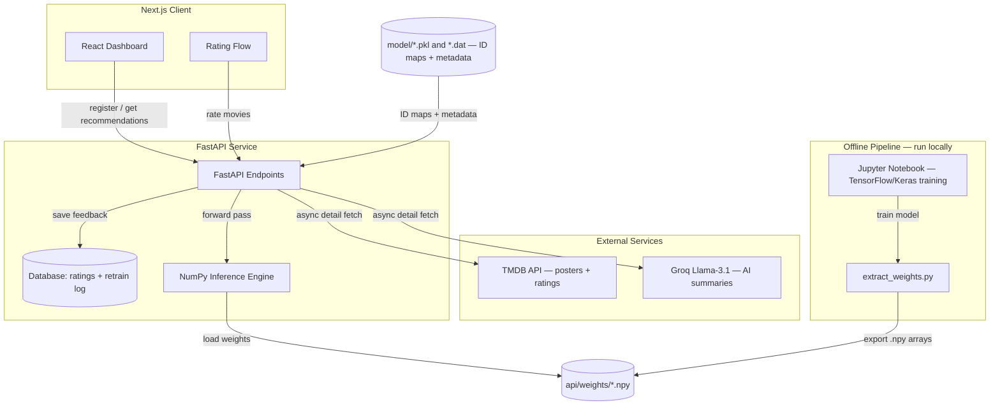

# 🎬 Neural Collaborative Filtering Recommender — Technical Documentation

A full-stack movie recommender built on the **Neural Collaborative Filtering (NeuMF)** architecture, trained on MovieLens 1M and deployed live on free-tier infrastructure. This document walks through the architecture, the machine-learning model, the key engineering decisions (and why they were made), the API and data design, and what a production version would do differently.

The defining decision in this project is that **the model is served without any deep-learning framework in memory** — the trained network's forward pass is reimplemented in pure NumPy. That single choice is what lets a TensorFlow-trained recommender run inside a 512 MB free-tier container. Most of this document explains how and why.

---

## 📌 System at a Glance

The system is split into four parts, each with a clear job:

1. **Next.js frontend** — a React/TypeScript dashboard for browsing recommendations, rating movies, and viewing model metrics.
2. **FastAPI backend** — serves recommendations from the NumPy engine, stores ratings in a database, and enriches results with posters and AI summaries.
3. **NumPy inference engine** — a framework-free reimplementation of the NeuMF forward pass; this is what actually scores movies in production.
4. **Offline training pipeline** — a Jupyter notebook where the full model is trained in TensorFlow/Keras and its weights are exported for the engine to use.

The important architectural idea: **training and serving are deliberately separated.** Training is heavy, occasional, and framework-dependent. Serving is light, constant, and framework-free. They are connected only by a folder of exported weight files.



---

## 🧠 The Model: Neural Collaborative Filtering (NeuMF)

This project implements the **NeuMF** architecture from *He et al., "Neural Collaborative Filtering" (WWW 2017)*.

### Why not plain matrix factorization?

Classic matrix factorization scores a user–item pair with a **dot product** of their latent vectors. That is a purely linear operation — it can only capture interactions that are, in effect, weighted sums. NeuMF keeps that linear signal but adds a neural branch that can learn non-linear interaction patterns, then fuses the two.

Concretely, every prediction flows through **two parallel branches** that are combined at the end:

```
                        Predicted score  ŷ(u,i)
                                 ▲
                                 │  sigmoid
                          Fused vector (48)
                                 ▲
                 ┌───────────────┴───────────────┐
              GMF branch (32)                MLP branch (16)
                 ▲                               ▲
        element-wise product              ReLU dense stack
          ┌──────┴──────┐                 ┌──────┴──────┐
      GMF user      GMF item          MLP user     MLP item
      embedding     embedding         embedding    embedding
        (32)          (32)              (32)          (32)
```

Each user and each item has **four** learned vectors — one pair for each branch. A single prediction pulls all four.

### The GMF branch (linear)

Takes the GMF user and item vectors and multiplies them **element-wise** (the Hadamard product):

$$\phi^{GMF} = \mathbf{p}_u^{G} \odot \mathbf{q}_i^{G}$$

This captures dimension-by-dimension alignment between a user's taste and an item's traits. Output: a 32-dimensional vector.

### The MLP branch (non-linear)

**Concatenates** the MLP user and item vectors into one 64-dimensional vector, then passes it through a stack of dense layers with ReLU activations, narrowing $64 \rightarrow 32 \rightarrow 16$:

$$\mathbf{z}_1 = [\,\mathbf{p}_u^{M},\; \mathbf{q}_i^{M}\,]$$
$$\phi_l = \text{ReLU}(\mathbf{W}_l^{\top}\phi_{l-1} + \mathbf{b}_l)$$

This learns higher-order interactions the GMF branch structurally cannot. Output: a 16-dimensional vector.

### Fusion

The two branch outputs are **concatenated** (GMF first, then MLP → 32 + 16 = 48 dimensions), passed through one final dense layer, and squashed by a sigmoid into a 0–1 interaction probability:

$$\phi^{NeuMF} = [\,\phi^{GMF},\; \phi^{MLP}\,], \qquad \hat{y}_{ui} = \sigma(\mathbf{h}^{\top}\phi^{NeuMF})$$

That final number is the recommendation score — higher means a stronger predicted match.

### Dataset and training setup

Trained on **MovieLens 1M**: 1,000,209 ratings from 6,040 users. Note that user and item IDs are remapped to a dense internal index space; the served item space is **13,706 items** and the user embedding table is sized at **16,040** (see *Dynamic User Registration* below for why it is larger than 6,040).

- **Implicit feedback**: explicit star ratings are binarized — an observed interaction is a positive (1), and unobserved user–item pairs are the negative class (0).
- **Negative sampling**: for each positive interaction, several unobserved items are sampled as negatives so the model learns to rank seen items above unseen ones.

### A note on evaluation numbers

The `/metrics` endpoint reports **Hit@10** and **NDCG@10** via leave-one-out evaluation. These land below the headline figures in the original paper, and the reason is **methodology, not a shrunken model** — the architecture here uses the standard 32-dimensional embeddings and the standard $64\rightarrow32\rightarrow16$ MLP.

The gap comes from two honest differences: the paper **pretrains** the GMF and MLP branches separately and then fine-tunes the fused model, and it uses a heavier negative-sampling regime. This implementation trains the fused model **end-to-end in a single pass** and evaluates over a 100-candidate leave-one-out protocol. The result is a lower but legitimate baseline — the number reflects the training/eval choices, and closing the gap is a matter of adding branch pretraining (noted in *Future Work*).

---

## ⚙️ The Core Engineering Decision: Framework-Free Serving

### The problem

The default way to serve a model is to wrap TensorFlow (or PyTorch) in a REST API. For a small free-tier deployment, that path breaks down:

1. **Image size** — the TensorFlow wheel alone is ~500 MB and pushes a Docker image well past 1 GB.
2. **Memory** — free tiers cap at **512 MB RAM**. Loading TensorFlow plus its graph state can exhaust that on startup and the container is killed (OOM) before it serves a single request.
3. **Cold start** — simply *importing* TensorFlow takes many seconds, which on a tier that sleeps when idle means the first request after a wake can time out.

These are not tuning problems. They are structural costs of keeping a training framework in the serving path.

### The insight

The API never trains. It only ever runs the model **forward** — take a user and a set of items, produce scores. And a forward pass for a *fixed, known* architecture is just arithmetic: four array lookups, an element-wise product, three small matrix multiplies with ReLU, a concatenation, and a sigmoid. None of that needs a deep-learning framework — it needs NumPy.

So the framework is used where it earns its keep (training) and removed where it only costs (serving).

### The pipeline

- **Offline (local, in TensorFlow):** train the model, evaluate, tune.
- **`extract_weights.py` (runs once):** open the trained `.h5`, pull out the 12 weight arrays by layer name, and save each as a `.npy` file. This is the *only* time TensorFlow touches the serving artifacts.
- **`ncf_numpy.py` (in production):** load those 12 arrays and run the exact forward pass in pure NumPy. No TensorFlow import anywhere in the serving process.

The 12 extracted arrays, validated on extraction against their expected shapes:

| Component | Shape |
|---|---|
| GMF user embedding | (16040, 32) |
| GMF item embedding | (13706, 32) |
| MLP user embedding | (16040, 32) |
| MLP item embedding | (13706, 32) |
| Dense 0 — kernel / bias | (64, 64) / (64,) |
| Dense 1 — kernel / bias | (64, 32) / (32,) |
| Dense 2 — kernel / bias | (32, 16) / (16,) |
| Output — kernel / bias | (48, 1) / (1,) |

### The forward pass in NumPy

```python
def score(user_ids: np.ndarray, item_ids: np.ndarray) -> np.ndarray:
    # 1. Embedding lookups — pure array indexing
    gmf_u = _W["gmf_user_emb"][user_ids]
    gmf_i = _W["gmf_item_emb"][item_ids]
    mlp_u = _W["mlp_user_emb"][user_ids]
    mlp_i = _W["mlp_item_emb"][item_ids]

    # 2. GMF branch — element-wise (Hadamard) product
    gmf = gmf_u * gmf_i

    # 3. MLP branch — concat, then ReLU dense stack (64 -> 32 -> 16)
    x = np.concatenate([mlp_u, mlp_i], axis=1)
    x = np.maximum(0.0, x @ _W["dense_kernel"]   + _W["dense_bias"])
    x = np.maximum(0.0, x @ _W["dense_1_kernel"] + _W["dense_1_bias"])
    x = np.maximum(0.0, x @ _W["dense_2_kernel"] + _W["dense_2_bias"])

    # 4. Fuse: GMF (32) then MLP (16) -> 48
    neu = np.concatenate([gmf, x], axis=1)

    # 5. Output + sigmoid
    logit = neu @ _W["dense_3_kernel"] + _W["dense_3_bias"]
    return (1.0 / (1.0 + np.exp(-logit))).ravel()
```

### Correctness: proven, not assumed

A reimplementation is only trustworthy if it matches the original. Before TensorFlow was removed from serving, a verification script scored the same random (user, item) pairs with both the TensorFlow model and the NumPy engine and compared them. They agree to within **~1e-8** — floating-point noise. That check is what makes it safe to delete the framework: the NumPy engine is not an approximation, it is the same function.

### The measured payoff

Benchmarked locally, 100 runs, single-threaded:

| Metric | NumPy engine | TensorFlow |
|---|---|---|
| Startup (import + model load) | **~5 ms** | ~16,500 ms |
| Score full catalog (13,706 items) — `/recommend` | **~12 ms** | ~500 ms |
| Score 100 candidates — per user in `/metrics` | **~0.14 ms** | ~61 ms |
| Weights resident in memory | **7.6 MB** | — |
| Serving image size | ~150 MB | ~1.5 GB |

The NumPy engine is faster on every axis — and it is worth being precise about *why*, because the reason is not "NumPy beats TensorFlow at matrix math." It doesn't. The difference is that `model.predict()` carries per-call overhead — input validation, graph execution machinery, batching logic — that is sized for large batched training and dominates when you score a single user against the catalog. Reimplementing only the forward pass strips that overhead away. Combined with dropping the ~500 MB framework from the image, this is precisely what lets the service boot near-instantly and fit inside 512 MB.

The honest framing: raw scoring speed was never the goal — 12 ms is far faster than any user notices. The goal was **footprint and startup**, and those are what make free-tier deployment possible at all.

---

## ⚡ Dynamic User Registration & Embedding Buffers

### The problem: embeddings are fixed-size

An embedding table has a fixed shape `(num_users, embedding_dim)`. If it is built for 6,040 users, asking for user 6,041 is an out-of-bounds index — the model cannot grow to accommodate a new sign-up at serving time, because the weight matrix is a fixed tensor baked into the trained model.

### The solution: reserve seats in advance

During training, the embedding tables are deliberately sized **larger** than the known user count — 6,040 real users plus a buffer, for 16,040 rows total. Rows `[0, 6039]` are trained on real MovieLens users; rows `[6040, 16039]` are untrained "reserved seats" holding small random values.

1. **Registration** — a new user is assigned the next free buffer slot via `/register`.
2. **Zero-crash serving** — because the slot already exists in the matrix, the NumPy engine scores the new user without error. Their initial recommendations reflect the untrained (near-random) embedding, so in practice new users are best served **cold-start popular results** until their embedding is trained.
3. **Learning their taste** — the user's ratings are stored, and a later offline retrain updates their reserved slot to reflect their actual preferences.

This is a pragmatic way to support live sign-ups on a model whose shape is otherwise frozen — trading a block of pre-allocated memory for the ability to onboard users without retraining the whole network on the spot.

---

## 📡 API Design

Built with FastAPI. The central design principle is **decoupling the fast path from the slow path.**

### The fast path vs. the slow path

`/recommend` must be quick, so it does the minimum: map the user ID, run the NumPy forward pass over all candidate items, drop already-seen movies, and return titles and IDs. It makes **no external calls** — no posters, no LLM, no network.

Enrichment (posters, AI summaries) is expensive and lives in a **separate** per-movie endpoint the frontend calls afterward, once per card, in parallel. A slow TMDB or Groq response therefore delays a single poster, never the recommendation list itself.

### Endpoints

**`POST /register`** — create or fetch a user by name.
```json
{ "internal_id": 6041, "raw_id": 6041, "is_new": true, "message": "Welcome!" }
```

**`POST /recommend`** — top-N personalized recommendations. Fast path: forward pass + filtering only. Payload `{"user_id": 6041, "top_n": 10}`.

**`POST /popular`** — cold-start recommendations by popularity/genre, for new users without a trained embedding.

**`GET /movie/{movie_id}/details`** — enrichment for one card:
1. local title lookup (instant),
2. async TMDB call for poster + community rating,
3. Groq `llama-3.1-8b-instant` for a 2-sentence summary grounded in the TMDB overview.
```json
{
  "movie_id": 1,
  "title": "Toy Story (1995)",
  "poster_url": "https://image.tmdb.org/t/p/w500/....jpg",
  "summary": "Woody and Buzz lead a story of friendship and imagination — a warm pick for animation lovers.",
  "tmdb_id": 862,
  "rating": 7.97
}
```

**`GET /metrics`** — Hit@K and NDCG@K via leave-one-out evaluation, computed with the same NumPy engine that serves recommendations.

**`POST /rate`** — store a user's rating; ratings accumulate for the offline retrain job.

**`POST /retrain`** — returns **501 Not Implemented** by design: retraining is an offline batch job in this deployment (see below), not an on-demand API action.

---

## 🔁 Retraining: An Offline Batch Job

Retraining is intentionally **not** an online operation here, and this is a direct consequence of the framework-free serving decision.

Retraining requires TensorFlow — but TensorFlow was deliberately removed from the serving container. So retraining runs **offline**: accumulated ratings are pulled from the database, the model is fine-tuned in TensorFlow locally, the weights are re-exported with `extract_weights.py`, and the new `.npy` folder is redeployed.

This mirrors how many real recommender systems actually operate — models retrain on a **schedule** (nightly/weekly), not on every user action. The `/retrain` endpoint returns 501 and the UI explains the offline design rather than pretending an on-demand retrain happens. It is an honest reflection of the train/serve split, not a missing feature.

---

## 💾 Database Schema

SQLAlchemy over a relational database, storing submitted ratings and a log of retraining runs.

**`ratings`** — feedback submitted through the UI:
```sql
CREATE TABLE ratings (
    id INTEGER PRIMARY KEY AUTOINCREMENT,
    user_id VARCHAR,
    raw_id INTEGER,
    internal_id INTEGER,
    movie_id INTEGER,
    score FLOAT,
    created_at DATETIME DEFAULT CURRENT_TIMESTAMP
);
CREATE INDEX ix_ratings_user_id ON ratings(user_id);
```

**`retraining_history`** — one row per offline retrain run, surfaced in the UI's activity view:
```sql
CREATE TABLE retraining_history (
    id INTEGER PRIMARY KEY AUTOINCREMENT,
    triggered_at DATETIME DEFAULT CURRENT_TIMESTAMP,
    new_ratings INTEGER,
    epochs INTEGER,
    loss_before FLOAT,
    loss_after FLOAT,
    status VARCHAR,
    notes TEXT
);
```

The database URL is environment-driven: it falls back to local SQLite for development and uses managed PostgreSQL in deployment, selected entirely by the `DATABASE_URL` environment variable with no code change.

---

## 🖥️ Frontend

Next.js with React hooks and functional components.

- **Discover** — enter an existing user ID for personalized picks, or browse popular movies by genre.
- **Rating flow** — new users pick a genre and rate movies (shown in batches) so their feedback is collected for the next offline retrain.
- **Metrics panel** — live Hit@K / NDCG@K from `/metrics`, giving visibility into model quality.
- **Per-card async enrichment** — each `MovieCard` fetches its poster, TMDB rating, and AI summary independently from `/movie/{id}/details`, showing skeletons while loading. This keeps the grid responsive and isolates any slow external call to a single card.

**A display detail worth noting:** the score shown on a card depends on its source. Personalized results carry a genuine 0–1 model score, shown as a "match %". Popular/genre results carry an average rating, shown as a star rating — never a percentage. This avoids the common bug of rendering a 1–5 rating as "500%".

---

## 🚀 Setup & Deployment

### Local development

```bash
# 1. Install dependencies
pip install -r requirements.txt

# 2. Environment (.env.local)
#    TMDB_API_KEY=...
#    GROQ_API_KEY=...
#    DATA_DIR=./data

# 3. Extract weights from the trained model (run once)
python api/extract_weights.py --model model/ncf_model.h5 --out api/weights

# 4. (optional) Verify the NumPy engine matches TensorFlow
python api/verify_equivalence.py --model model/ncf_model.h5 --weights api/weights

# 5. Run the API
uvicorn api.main:app --host 127.0.0.1 --port 8000 --reload
```

### Docker & deployment

The service is containerized with a Dockerfile written for a minimal, framework-free image. Key production details:

- **Code vs. state separation** — application code lives in a read-only `/app`; all writable state (SQLite fallback, user registry, ratings) goes to a writable `/data` owned by a non-root user, so the container runs unprivileged without permission errors.
- **Dynamic port** — the server binds to the platform-provided `$PORT` (shell-form `CMD` so the variable expands).
- **Deployed as:** backend container on **Render** with managed PostgreSQL; Next.js frontend on **Vercel**, pointed at the backend via `NEXT_PUBLIC_API_URL`.

```bash
docker build -t neumf-recommender .
docker run -p 8000:8000 -e PORT=8000 -e TMDB_API_KEY=... -e GROQ_API_KEY=... neumf-recommender
```

---

## 🔭 Future Work

Honest next steps, roughly in order of value:

1. **Close the accuracy gap** — add the paper's GMF/MLP branch pretraining before fusion, and a heavier negative-sampling regime, to lift Hit@10 / NDCG@10 toward the published baseline.
2. **Automate the offline retrain** — a scheduled job (e.g. nightly) that pulls new ratings, fine-tunes, re-exports weights, and redeploys, closing the loop the current manual process handles.
3. **Persist retrained weights durably** — free-tier disks are ephemeral; a model registry or object store would let retrained weights survive restarts rather than living in the container.
4. **Cache `/metrics`** — leave-one-out evaluation is recomputed on request; caching or precomputing it removes avoidable work under load.
5. **Package the inference engine** — `ncf_numpy.py` is a clean, dependency-light library and is a natural candidate to publish as a standalone pip package, with the trained weights distributed via the Hugging Face Hub.

---

## Summary

The heart of this project is a single, defensible engineering decision: **separate the training runtime from the serving runtime.** Train in TensorFlow where the framework is worth its weight; serve in NumPy where it isn't. The forward pass was reimplemented from the model's architecture, proven identical to the original to 1e-8, and shipped in a container an order of magnitude smaller than a framework-based equivalent — which is what makes the whole system deployable, live, for free.