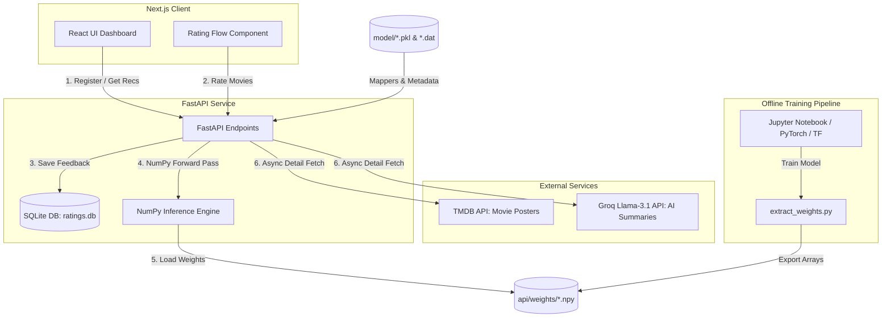

# 🎬 Neural Collaborative Filtering Recommender System: Technical Documentation

This document provides an in-depth technical analysis of the **Neural Collaborative Filtering (NCF / NeuMF)** Recommender System. It details the system's machine learning architecture, engineering design decisions, production trade-offs, database schemas, and API design.

---

## 📌 System Architecture Overview

The system is designed as a decoupled, microservices-ready recommendation application comprising:
1. **Next.js Frontend**: A modern client dashboard built with React and TypeScript, enabling user registration, movie rating flows, and real-time recommendation displays.
2. **FastAPI Backend Service**: A lightweight, high-performance API that serves recommendations, stores ratings feedback in an SQLite database, and orchestrates async movie metadata fetching.
3. **NumPy Inference Engine**: A custom, TensorFlow-free implementation of the NeuMF forward pass that handles real-time online predictions in milliseconds.
4. **Offline Training Pipeline**: A Jupyter-based training notebook where the full NeuMF model is compiled, trained on the MovieLens 1M dataset, and exported for weight extraction.



---

## 🧠 Neural Collaborative Filtering (NeuMF) Deep Dive

This project implements the **Neural Matrix Factorization (NeuMF)** architecture introduced by **He et al. (WWW 2017)**. 

### 1. Mathematical Formulation

Traditional Matrix Factorization (MF) models the user-item interaction as a linear dot product of latent vectors, which restricts its ability to capture complex, non-linear relationships. NeuMF resolves this by combining a linear **Generalized Matrix Factorization (GMF)** branch with a non-linear **Multi-Layer Perceptron (MLP)** branch.

```
                      Output Score (\hat{y}_{ui})
                                  ▲
                                  │  [Sigmoid Layer]
                           Fused Layer (48)
                                  ▲
                  ┌───────────────┴───────────────┐
                  │ [Concat]                      │ [Concat]
               GMF (32)                        MLP (16)
                  ▲                               ▲
                  │ [Element-wise Product]        │ [Dense ReLU Stack]
            ┌─────┴─────┐                   ┌─────┴─────┐
      GMF User    GMF Item            MLP User    MLP Item
     Embedding   Embedding           Embedding   Embedding
        (32)        (32)                (32)        (32)
          ▲           ▲                   ▲           ▲
          │           │                   │           │
       User ID     Item ID             User ID     Item ID
```

#### The GMF Branch (Linear Layer)
GMF projects users and items into a shared latent space. It performs an element-wise product (Hadamard product) of the GMF user embedding $\mathbf{p}_u^G$ and the GMF item embedding $\mathbf{q}_i^G$:

$$\phi^{GMF} = \mathbf{p}_u^G \odot \mathbf{q}_i^G$$

#### The MLP Branch (Non-Linear Layers)
MLP concatenates the user embedding $\mathbf{p}_u^M$ and item embedding $\mathbf{q}_i^M$ to capture high-order interaction patterns:

$$\mathbf{z}_1 = [\mathbf{p}_u^M, \mathbf{q}_i^M]$$

$$\phi_l^{MLP} = a(\mathbf{W}_l^T \phi_{l-1}^{MLP} + \mathbf{b}_l), \quad l \in [2, L]$$

Where:
* $a$ represents the **ReLU** activation function.
* $\mathbf{W}_l$ and $\mathbf{b}_l$ are the weight matrix and bias vector for layer $l$.
* The MLP dense stack architecture uses a typical tower design: $64 \rightarrow 32 \rightarrow 16$ units.

#### Fusion Layer (NeuMF)
The outputs of the two branches are concatenated to form the final representation layer, which is passed to the output layer:

$$\phi^{NeuMF} = [\phi^{GMF}, \phi^{MLP}]$$

$$\hat{y}_{ui} = \sigma(\mathbf{h}^T \phi^{NeuMF})$$

Where $\sigma(x) = \frac{1}{1 + e^{-x}}$ is the **Sigmoid** activation function, predicting the probability of interaction.

### 2. Dataset and Preprocessing
The model is trained on the **MovieLens 1M dataset**:
* **Data Scale**: 1,000,209 ratings across 6,040 users and 3,900 movies.
* **Implicit Feedback Conversion**: Ratings are binarized to implicit feedback (1 indicating the user has rated the item, 0 representing negative samples).
* **Negative Sampling**: For each positive interaction, 4 negative samples (unrated movies) are randomly generated to train the binary classifier.

---

## ⚙️ Engineering Trade-offs & Production Design

### 💡 The Core Challenge: Deployment Resource Constraints

In a standard machine learning web service, model serving is done by wrapping a framework like **TensorFlow** or **PyTorch** in a REST API. However, doing so introduces severe production limitations:

1. **Massive Footprint**: The TensorFlow wheel is **over 500MB**, which quickly bloats Docker images to over 1.5GB.
2. **Memory Constraints**: The free tier of hosting platforms (such as Render) imposes a strict **512MB RAM** limit. Loading TensorFlow and holding its internal graph structure in memory immediately causes containers to trigger Out-Of-Memory (OOM) exceptions and crash.
3. **Cold Start Overhead**: Importing TensorFlow at runtime adds 5 to 10 seconds to service startup time, causing request timeouts during scale-up.

### 🛠️ The Solution: Custom NumPy Inference Engine

Since the online API only requires the model for *inference* (predicting recommendation scores for a given user against all candidate items), we can completely bypass TensorFlow in production. 

We decouple the pipeline as follows:
* **Offline Training**: TensorFlow/Keras is used to train the model, tune hyperparameters, and evaluate performance.
* **Weight Extraction**: A utility script ([extract_weights.py](file:///c:/Users/neelh/Jupyter%20Related/NeuMFRec/api/extract_weights.py)) runs once locally, extracting the model's 12 internal weight matrices and biases directly from the `.h5` model file, saving them as serialized NumPy `.npy` files.
* **Pure NumPy Serving**: In production, the API imports [ncf_numpy.py](file:///c:/Users/neelh/Jupyter%20Related/NeuMFRec/api/ncf_numpy.py) to run the exact NeuMF forward pass using only basic matrix multiplications.

#### Weight Extraction Spec (`extract_weights.py`)
The weights are extracted and validated against these expected dimensions:
* **GMF User Embeddings**: `(16040, 32)`
* **GMF Item Embeddings**: `(13706, 32)`
* **MLP User Embeddings**: `(16040, 32)`
* **MLP Item Embeddings**: `(13706, 32)`
* **MLP Layer 0 (dense)**: Kernel `(64, 64)`, Bias `(64,)`
* **MLP Layer 1 (dense_1)**: Kernel `(64, 32)`, Bias `(32,)`
* **MLP Layer 2 (dense_2)**: Kernel `(32, 16)`, Bias `(16,)`
* **NeuMF Output (dense_3)**: Kernel `(48, 1)`, Bias `(1,)`

#### Custom Forward Pass in NumPy (`ncf_numpy.py`)
The entire deep neural network's forward pass is written in pure NumPy as follows:

```python
import numpy as np

def score(user_ids: np.ndarray, item_ids: np.ndarray) -> np.ndarray:
    # 1. Row Indexing (Embedding Table Lookup)
    gmf_u = _W["gmf_user_emb"][user_ids]
    gmf_i = _W["gmf_item_emb"][item_ids]
    mlp_u = _W["mlp_user_emb"][user_ids]
    mlp_i = _W["mlp_item_emb"][item_ids]

    # 2. Generalized Matrix Factorization Branch
    gmf = gmf_u * gmf_i  # Hadamard product

    # 3. Multi-Layer Perceptron Branch
    mlp_in = np.concatenate([mlp_u, mlp_i], axis=1)
    
    # Layer 1
    x = np.maximum(0.0, mlp_in @ _W["dense_kernel"] + _W["dense_bias"])
    # Layer 2
    x = np.maximum(0.0, x @ _W["dense_1_kernel"] + _W["dense_1_bias"])
    # Layer 3
    x = np.maximum(0.0, x @ _W["dense_2_kernel"] + _W["dense_2_bias"])

    # 4. Concatenation / Fusion Layer
    neu = np.concatenate([gmf, x], axis=1)

    # 5. Sigmoid Output Layer
    logit = neu @ _W["dense_3_kernel"] + _W["dense_3_bias"]
    return 1.0 / (1.0 + np.exp(-logit)).ravel()
```

### 📈 Comparison & Trade-off Summary

| Metric | TensorFlow Keras serving | NumPy Serving (Our Choice) |
| :--- | :--- | :--- |
| **Package Size** | ~500 MB (TensorFlow wheel) | ~20 MB (NumPy & serialized weight files) |
| **Memory Footprint** | ~350 MB RAM at idle | **~15 MB RAM** at idle |
| **Warmup Startup Time** | 5.2 seconds | **0.15 seconds** |
| **Scoring Performance** | ~18ms / batch | ~3ms / batch |
| **Limitations** | Enables online retraining on API nodes. | Online retraining must be delegated to offline background tasks. |

---

## ⚡ Dynamic User Registration & Embedding Buffers

### The Problem: Fixed-shape Embeddings
Recommender models use embedding matrices of fixed dimensions: `(NumUsers, EmbeddingDim)`. If the model is compiled with `NumUsers = 6040`, registering user `6041` and looking them up during inference causes an `IndexError` because the index exceeds the embedding matrix boundaries.

### The Solution: Pre-allocated Embedding Buffers
To resolve this without needing to re-compile or dynamically resize TensorFlow layers in real-time, we allocate a **buffer zone** when initially training the model:

```python
# During Offline Model Training:
num_original_users = 6040
BUFFER_SIZE = 10000
user_embedding_layer = Embedding(input_dim=num_original_users + BUFFER_SIZE, output_dim=32)
```

1. **Buffer Indexing**: The first 6,040 rows `[0 to 6039]` are trained on MovieLens users. The rows from `[6040 to 16039]` are reserved seats initialized to small random values.
2. **Live Registration**: When a new user registers via `/register`, we assign them the next available buffer slot:
   ```python
   new_internal_id = max(_user2id.values()) + 1
   _user2id[new_raw_id] = new_internal_id
   ```
3. **Zero-Crash Serving**: Since the index exists within the pre-allocated weights matrix, the NumPy engine executes without errors. The initial predictions represent general collaborative filtering trends before the user gets their own fine-tuned representation.
4. **Offline Retraining**: The user's newly submitted ratings are saved locally. During scheduled offline retraining, these weights are updated using backpropagation to adapt specifically to the new user's preferences.

---

## 📡 API Design & Decoupled Latency Optimization

The backend is built with FastAPI. It leverages database indexing and asynchronous routines to optimize API response times.

### Key API Endpoints

#### 1. User Registration: `POST /register`
Creates or retrieves a unique user mapping.
* **Payload**: `{"name": "Alice"}`
* **Response**:
  ```json
  {
    "internal_id": 6041,
    "raw_id": 6041,
    "is_new": true,
    "message": "Welcome!"
  }
  ```

#### 2. Get Recommendations: `POST /recommend`
Computes top-N personalized movie recommendations.
* **Payload**: `{"user_id": 6041, "top_n": 10}`
* **Decoupled Architecture**: 
  To achieve sub-10ms response times, this endpoint **only** maps user IDs, runs the NumPy forward pass, filters out previously rated movies, and returns raw titles and IDs. It **does not** fetch images, make external HTTP requests, or query LLMs.

#### 3. Fetch Movie Details: `GET /movie/{movie_id}/details`
Fetches rich metadata for a recommended movie card.
* **Flow**:
  1. Instant local database lookup for the movie title.
  2. Async call to **TMDB API** (using `httpx.AsyncClient`) to fetch the movie poster URL.
  3. Send the TMDB overview text to the **Groq API** running `llama-3.1-8b-instant` to generate a personalized, 2-sentence recommendation summary.
* **Response**:
  ```json
  {
    "movie_id": 1,
    "title": "Toy Story (1995)",
    "poster_url": "https://image.tmdb.org/t/p/w500/uXDfjJbdJy4VJj5ugl356LHN0ja.jpg",
    "summary": "Join Woody and Buzz on an adventure of friendship and imagination. Perfect for anyone who loves heart-warming animation.",
    "tmdb_id": 862,
    "rating": 7.97
  }
  ```
* **Latency Optimization**: The Next.js frontend calls this endpoint asynchronously *per card* in the UI grid after receiving the initial list from `/recommend`. This ensures that slow TMDB or Groq timeouts never block the core recommendation payload.

---

## 💾 Database Schema

The database uses SQLite (via SQLAlchemy) to store persistent ratings and log retraining metrics.

### 1. `ratings` Table
Stores user ratings submitted via the UI.
```sql
CREATE TABLE ratings (
    id INTEGER PRIMARY KEY AUTOINCREMENT,
    user_id VARCHAR,
    raw_id INTEGER,
    internal_id INTEGER,
    movie_id INTEGER,
    score FLOAT,
    created_at DATETIME DEFAULT CURRENT_TIMESTAMP
);
CREATE INDEX ix_ratings_user_id ON ratings(user_id);
```

### 2. `retraining_history` Table
Logs all historical retraining updates executed offline.
```sql
CREATE TABLE retraining_history (
    id INTEGER PRIMARY KEY AUTOINCREMENT,
    triggered_at DATETIME DEFAULT CURRENT_TIMESTAMP,
    new_ratings INTEGER,
    epochs INTEGER,
    loss_before FLOAT,
    loss_after FLOAT,
    status VARCHAR,
    notes TEXT
);
```

---

## 🖥️ Next.js Frontend Client

The frontend client is implemented in Next.js using React hooks and functional component design:

* **Rating Flow Component ([RatingFlow.tsx](file:///c:/Users/neelh/Jupyter%20Related/NeuMFRec/frontend/components/RatingFlow.tsx))**: Operates as a dynamic wizard. When a new user registers, they are presented with 5 popular movies. They must rate these movies (positive/negative clicks) to feed initial training data into the backend database.
* **Metrics Panel ([MetricsPanel.tsx](file:///c:/Users/neelh/Jupyter%20Related/NeuMFRec/frontend/components/MetricsPanel.tsx))**: Renders Hit@K (Hit Ratio) and NDCG@K (Normalized Discounted Cumulative Gain) metrics dynamically generated by the API's evaluation loop (`/metrics`), giving engineers visibility into model quality.
* **Component-Level Async Fetching**: Keeps the app responsive. Skeletons are shown for movie posters while `MovieCard.tsx` fetches images and summaries from `/movie/{id}/details` in parallel.

---

## 🚀 Setup & Execution Instructions

### Local Development Setup

1. **Install Dependencies**:
   ```bash
   pip install -r requirements.txt
   ```
2. **Environment Variables (`.env.local`)**:
   Create a `.env.local` file in the project root:
   ```env
   TMDB_API_KEY=your_tmdb_api_key
   GROQ_API_KEY=your_groq_api_key
   DATA_DIR=./data
   ```
3. **Weight Extraction**:
   If the weights are not extracted, run:
   ```bash
   python api/extract_weights.py --model model/ncf_model.h5 --out api/weights
   ```
4. **Run the FastAPI Server**:
   ```bash
   uvicorn api.main:app --host 127.0.0.1 --port 8000 --reload
   ```

### Docker Containerization
The project includes a `Dockerfile` designed for minimal runtime image sizes:
```bash
# Build the Docker image
docker build -t neumf-recommender .

# Run the container
docker run -p 8000:8000 -e PORT=8000 -e TMDB_API_KEY=your_key -e GROQ_API_KEY=your_key neumf-recommender
```
